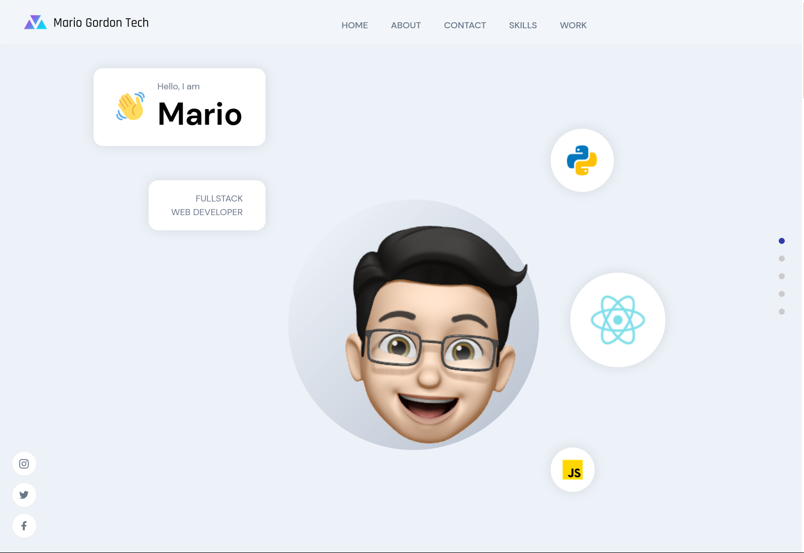
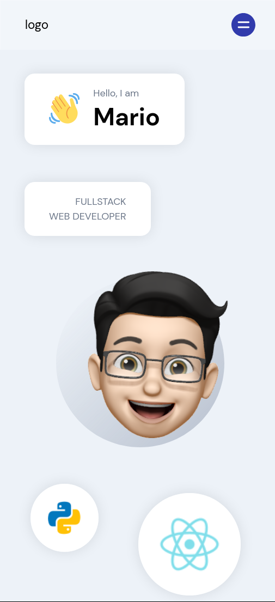

# Personal Branding Porfolio

## What do you get in return:

#### Hero desktop



### Hero Responsive Design



#### Complete website SPA

<p></p>

---

## Tech stack:

### Frontend:

- HTML 5 for document structure
- CSS 3 - Bootstrap 5 for styling
- Javascript ES6+ - React 17 (SPA)

## Hosting:

- Heroku for deployment itself

## Project management:

- Git and Github for version control

---

## Contributors:

Team who participated in this project:

- [Mario Gordon](https://github.com/maegop)

---

## Where can you find the project?

### [Working website](http://no-country-c03-g57-frontend.herokuapp.com/)

---

## Getting started with the project 🚀

The following instructions will get you a copy of the project up and running on your local machine for development purposes.
You'll need to do a couple of things in order to run this project on your local machine:

1. Clone the repository:

```sh
git clone https://github.com/maegop/Personal-Portfolio-Website.git
```

2. Install dependencies:

```sh
npm install # or yarn install
```

3. Run the frontend server:

```sh
npm start # or yarn start
```

4. Open the frontend in your browser:

```sh
http://localhost:3000
```

---
